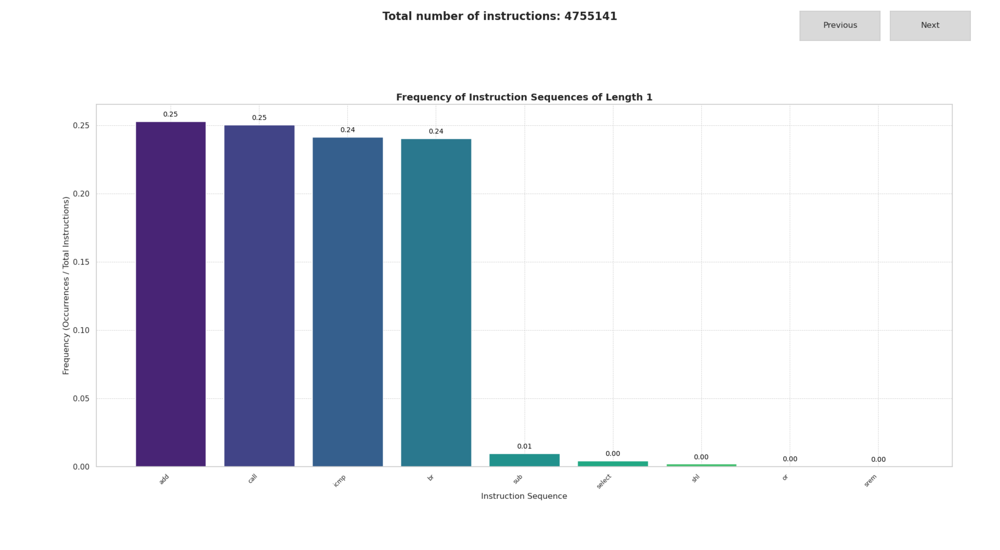
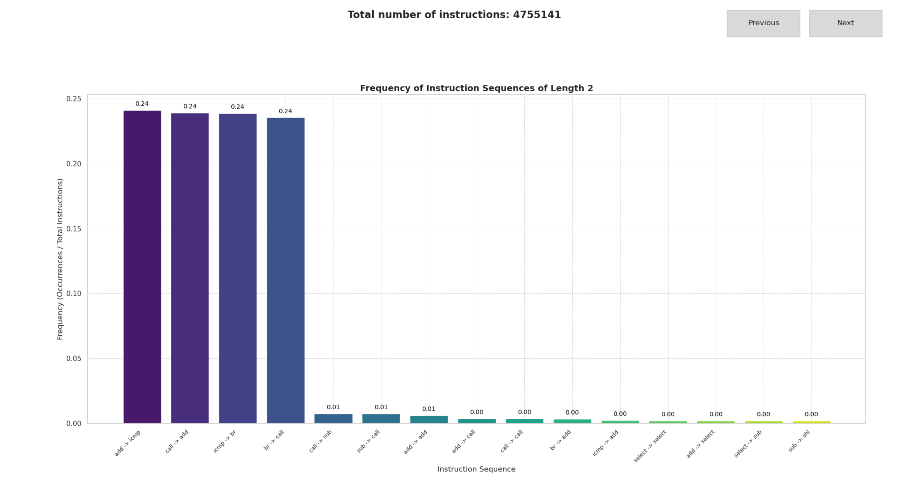
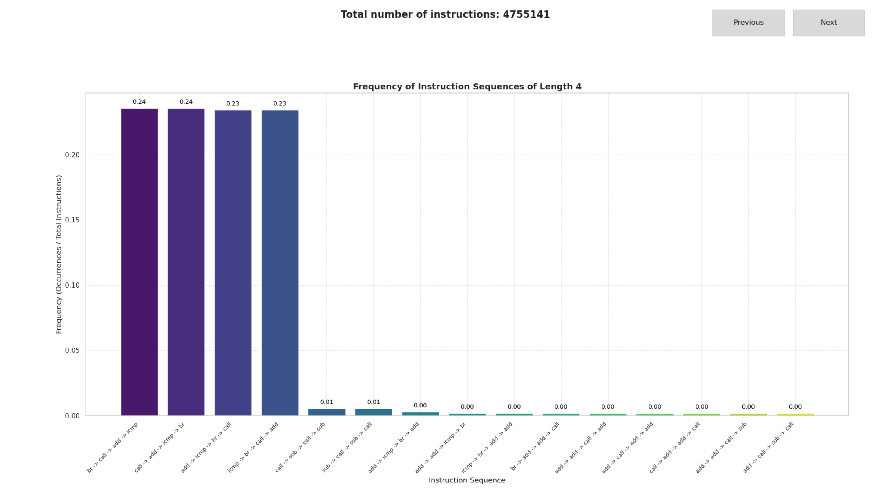
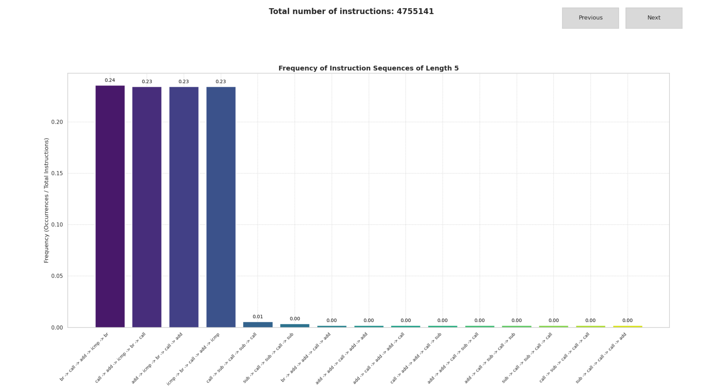

# PassTraceInstructions
This pass prints execeuted IR instructions and their uses
## Build and Run
> [!IMPORTANT]
> To succesfully build the task it is better to use `nix-shell`.  
> Take a look on main README.md

Build instrumented application:
```
$> mkdir build && cd build
$> cmake ..
$> make
# It wiil produce build/instrumented_app
$> ./instrumented_app
```
Collect statistics:
```
$> ./instrumented_app > ./traces.log
#Kill application by Ctrl+C or close the graphical window
$> python3 ../analyze.py ./traces.log
#Enjoy plots
```
## Statistics
Generated LLVM IR instructions:
```
Instruction Counts:
===================
add: 1200915
call: 1190060
icmp: 1147158
br: 1142583
sub: 44582
select: 20041
shl: 8686
or: 1086
srem: 30
```
Graphs:





### Build and Run (Legacy)
now in repo presented c code example, how to run it:
1. Build library with pass:
```
$> sudo apt install llvm
$> clang++ -fPIC -shared -o ./c_test/libPassTraceInstructions.so PassTraceInstructions.cpp \
   `llvm-config --cxxflags --ldflags --system-libs --libs core`
```
2. Apply to code, wich computes factorial:
```
$> clang -O2 -S -fno-slp-vectorize -fno-vectorize -mllvm -unroll-count=2 -emit-llvm ./c_test/fact.c -o ./c_test/fact.ll
$> opt -load-pass-plugin=./c_test/libPassTraceInstructions.so -passes="trace-instruction" -S -o ./c_test/fact_instrumented.ll ./c_test/fact.ll
```
3. Build and run executable
```
$> clang ./c_test/fact_instrumented.ll ./log.c ./c_test/start.c -o ./c_test/fact
$> ./c_test/fact 6
```